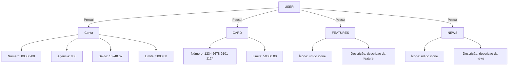

#PROJETO 
* DIO - Publicando API na Nuvem

#DIAGRAMA DE CLASSES

```mermaid
graph TD;
    A["USER"]
    A -->|Possui| B["Conta"]
    B --> C["Número: 00000-00"]
    B --> D["Agência: 000"]
    B --> E["Saldo: 15948.67"]
    B --> F["Limite: 3000.00"]

    A -->|Possui| G["CARD"]
    G --> H["Número: 1234 5678 9101 1124"]
    G --> I["Limite: 50000.00"]

    A -->|Possui| J["FEATURES"]
    J --> K["Ícone: url do icone"]
    J --> L["Descrição: descricao da feature"]

    A -->|Possui| M["NEWS"]
    M --> N["Ícone: url do icone"]
    M --> O["Descrição: descricao da news"]
```
